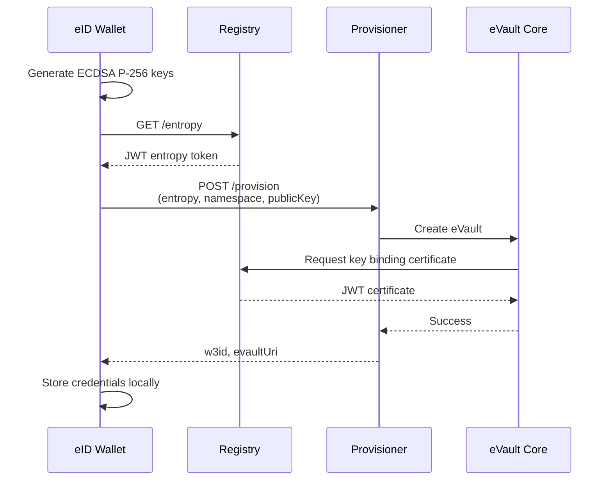
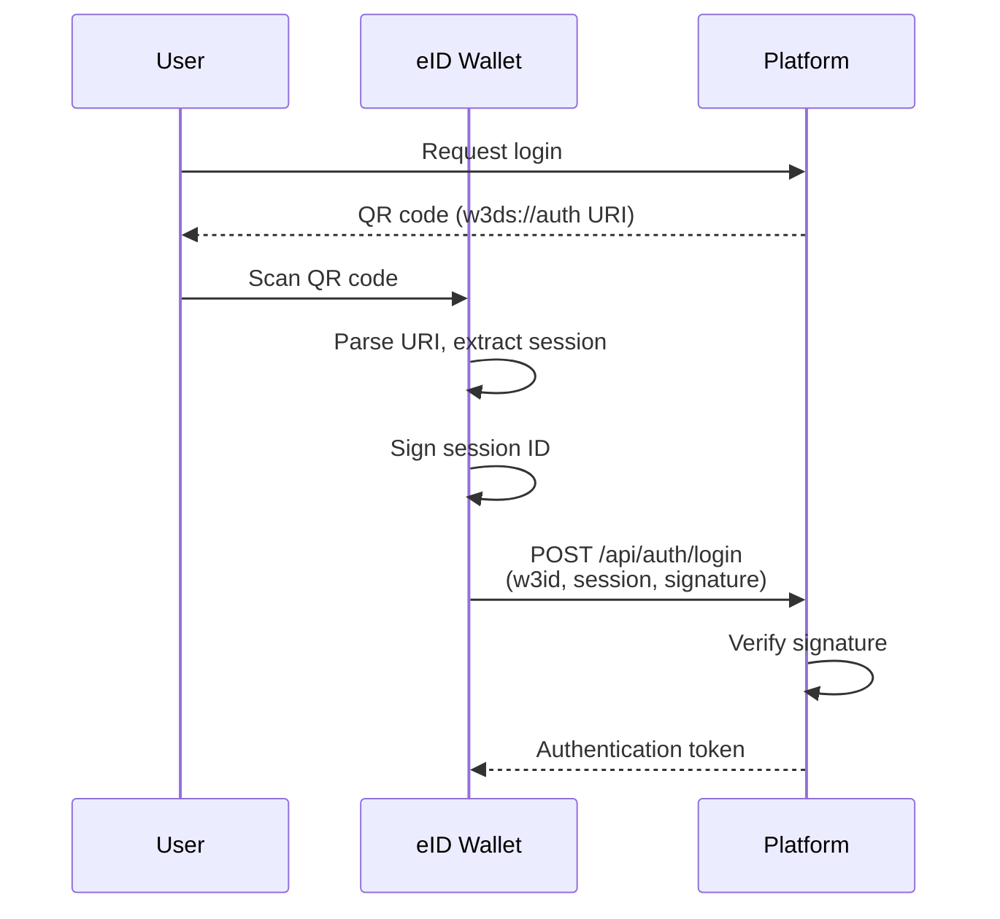
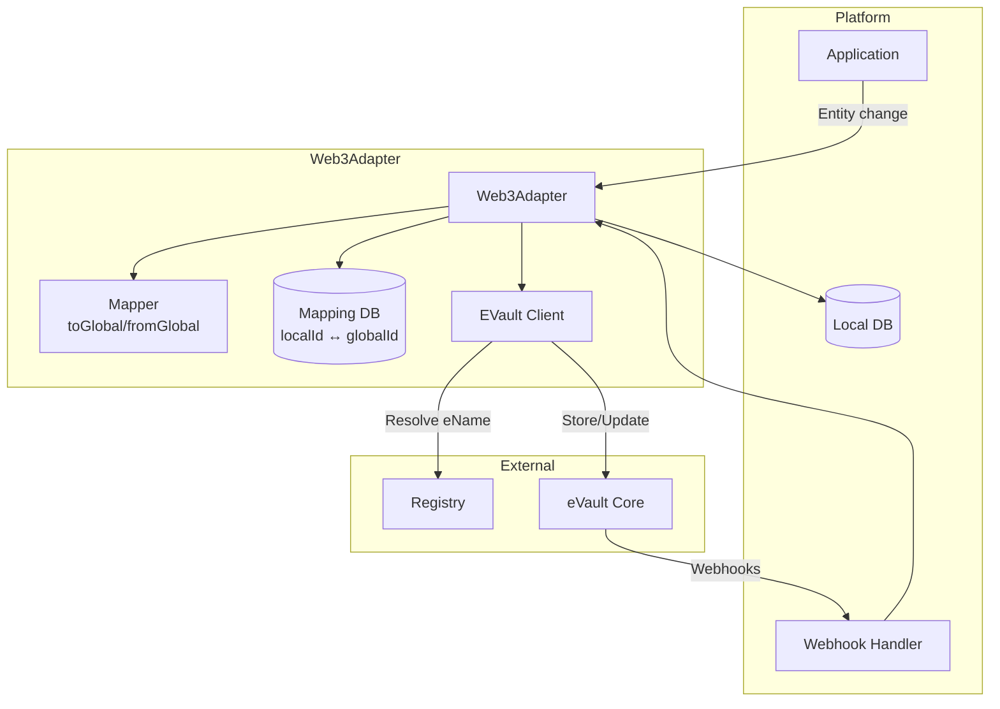
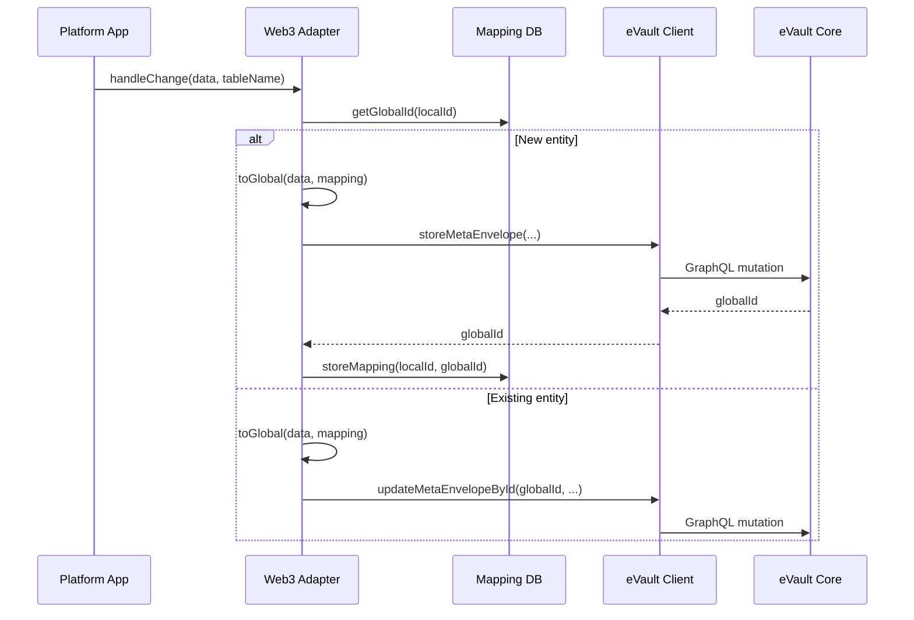
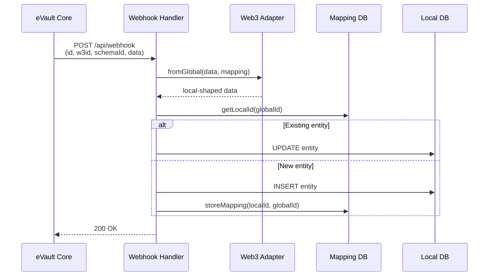
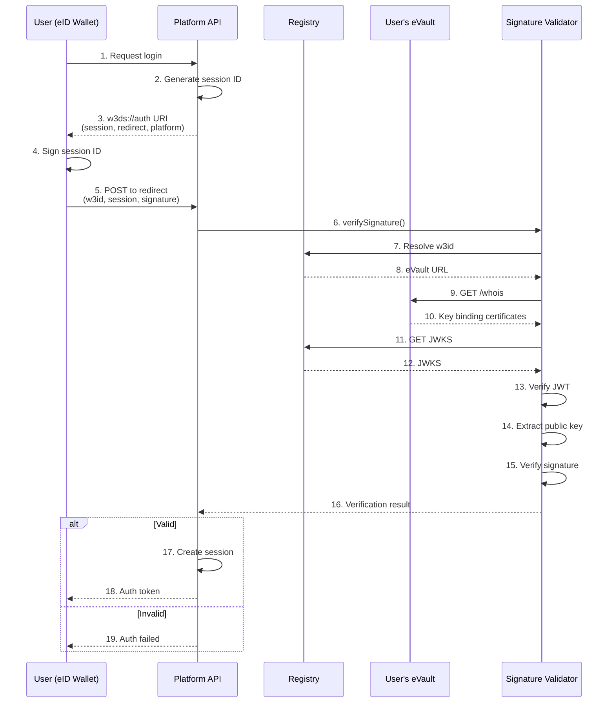
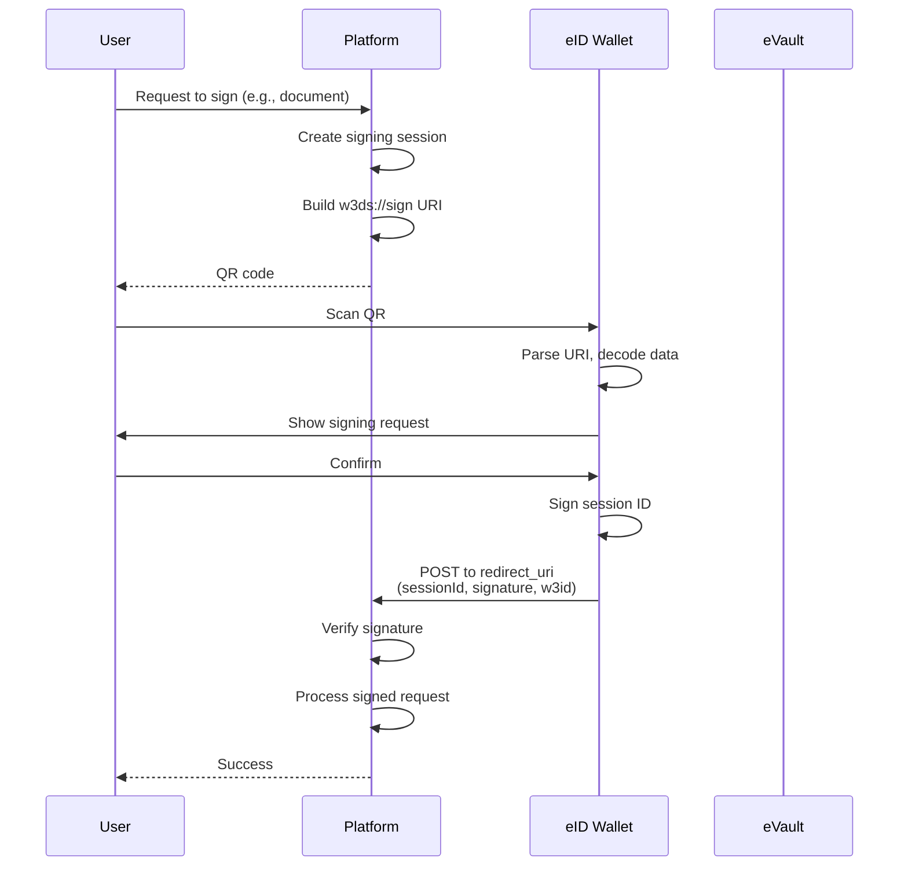
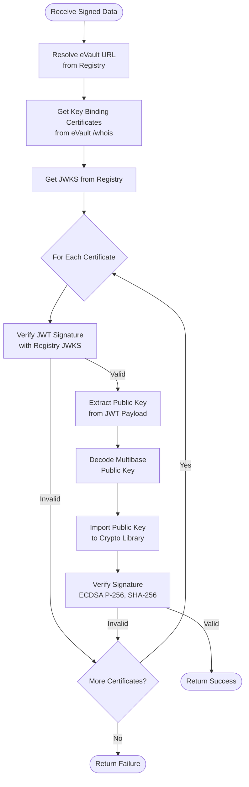
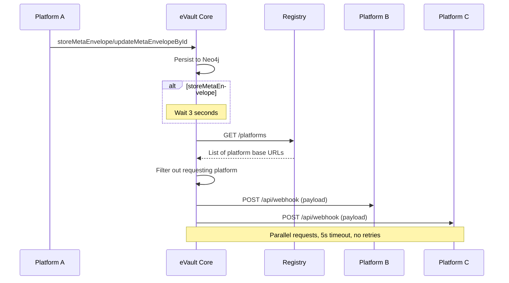
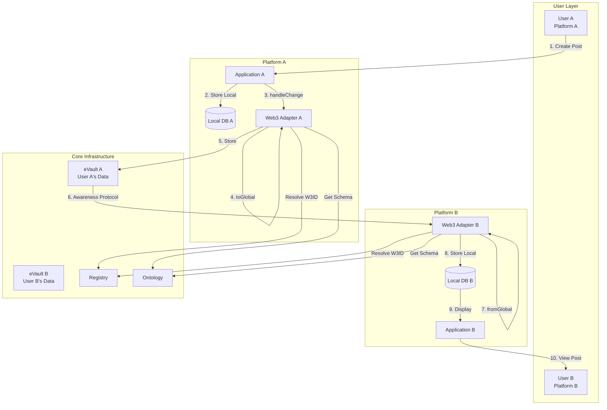

# W3DS Infrastructure & Protocol Documentation

This document provides a comprehensive overview of the W3DS (Web3 Data Space) infrastructure, core protocols, and component architecture. W3DS enables users to store data in personal eVaults while platforms act as interchangeable frontends, creating a decentralized, user-owned data ecosystem.

## Table of Contents

1. [Architecture Overview](#architecture-overview)
2. [Core Components](#core-components)
3. [W3DS Protocol](#w3ds-protocol)
4. [Security & Cryptography](#security--cryptography)
5. [Data Flow & Synchronization](#data-flow--synchronization)
6. [Implementation Guide](#implementation-guide)

---

## Architecture Overview

### System Architecture

W3DS follows a decentralized architecture where users own their data in personal eVaults, and platforms synchronize data through a universal ontology:

### Key Principles

1. **User Data Ownership**: Users own their data in personal eVaults identified by W3IDs
2. **Platform Interchangeability**: Platforms act as frontends; data persists across platform switches
3. **Universal Ontology**: Standardized schemas enable cross-platform data understanding
4. **Cryptographic Authentication**: Signature-based authentication using e.g., ECDSA P-256
5. **Eventual Consistency**: Webhook-based synchronization (Awareness Protocol)

---

## Core Components

### 1. eVault (Personal Data Store)

eVault is the core storage system for user data in W3DS. Each user has a personal eVault where all data is stored in standardized MetaEnvelopes.

#### Key Features

- **GraphQL API**: Store, retrieve, update, and search data
- **Access Control**: ACL-based permissions for data access
- **Webhook Delivery**: Automatic notifications via Awareness Protocol
- **Key Binding**: Stores user public keys for signature verification
- **Multi-Tenancy**: Supports shared infrastructure with per-W3ID isolation

#### Data Model

**MetaEnvelope** (top-level container):
- `id`: Unique W3ID identifier
- `ontology`: Schema identifier (W3ID)
- `acl`: Access Control List (array of W3IDs or `["*"]` for public)
- `envelopes`: Array of Envelope nodes

**Envelope** (individual fields):
- `id`: Unique identifier
- `fieldKey`: Field name from payload (e.g., "content", "authorId")
- `ontology`: Alias for fieldKey (backward compatibility)
- `value`: Actual field value
- `valueType`: Type ("string", "number", "object", "array")

**Storage Structure** (Neo4j):
```cypher
(MetaEnvelope {id, ontology, acl}) -[:LINKS_TO]-> (Envelope {id, value, valueType})
```

#### GraphQL API

**Core Queries**:
```graphql
# Retrieve single MetaEnvelope
metaEnvelope(id: ID!): MetaEnvelope

# List MetaEnvelopes with pagination and filtering
metaEnvelopes(
  filter: MetaEnvelopeFilter
  first: Int
  after: String
): MetaEnvelopeConnection
```

**Core Mutations**:
```graphql
# Create new MetaEnvelope
createMetaEnvelope(input: MetaEnvelopeInput!): CreateMetaEnvelopeResult

# Update existing MetaEnvelope
updateMetaEnvelope(id: ID!, input: MetaEnvelopeInput!): UpdateMetaEnvelopeResult

# Delete MetaEnvelope
removeMetaEnvelope(id: ID!): RemoveMetaEnvelopeResult

# Bulk create (for migrations)
bulkCreateMetaEnvelopes(
  inputs: [MetaEnvelopeInput!]!
  skipWebhooks: Boolean
): BulkCreateResult
```

#### HTTP API

**GET /whois**
```http
GET /whois
X-ENAME: @user-a.w3id

Response:
{
  "w3id": "@user-a.w3id",
  "evaultId": "evault-identifier",
  "keyBindingCertificates": [
    "eyJhbGciOiJFUzI1NiIsInR5cCI6IkpXVCJ9..."
  ]
}
```

**GET /logs** (pagination)
```http
GET /logs?limit=20&cursor=...
X-ENAME: @user-a.w3id

Response:
{
  "logs": [...],
  "nextCursor": "...",
  "hasMore": true
}
```

**PATCH /public-key**
```http
PATCH /public-key
X-ENAME: @user-a.w3id
Authorization: Bearer <token>

{
  "publicKey": "z3059301306..."
}
```

#### Access Control

ACL enforcement:
- `["*"]`: Public read access (anyone can read, only owner can write)
- `["@user-a.w3id"]`: Only User A can access
- `["@user-a.w3id", "@user-b.w3id"]`: Multiple users

### 2. Registry Service

The Registry provides W3ID-based service discovery, entropy generation, and (temporarily) key binding certificates.

#### Core Functions

1. **Service Discovery**: Resolve W3IDs to service endpoints
2. **Entropy Generation**: Cryptographically secure random values for provisioning
3. **Platform Certification**: JWT tokens for platform authentication
4. **Key Binding**: Temporary function (will move to Remote CA)

#### API Endpoints

**Service Resolution**:
```http
GET /resolve?w3id=@user.w3id

Response:
{
  "ename": "@user.w3id",
  "uri": "https://evault.example.com",
  "evault": "evault-identifier"
}
```

**Entropy Generation**:
```http
GET /entropy

Response:
{
  "token": "eyJhbGciOiJFUzI1NiIs..."
}

JWT Payload:
{
  "entropy": "AbCdEfGhIjKlMnOpQrSt",  // 20 chars
  "iat": 1640995200,
  "exp": 1640998800  // 1 hour validity
}
```

**Platform Certification**:
```http
POST /platforms/certification

{
  "platform": "platform-identifier"
}

Response:
{
  "token": "eyJhbGciOiJFUzI1NiIs..."
}

JWT Payload:
{
  "platform": "platform-name",
  "iat": 1640995200,
  "exp": 1672531200  // 1 year validity
}
```

**Key Discovery (JWKS)**:
```http
GET /.well-known/jwks.json

Response:
{
  "keys": [
    {
      "kty": "EC",
      "crv": "P-256",
      "x": "...",
      "y": "...",
      "kid": "key-id",
      "alg": "ES256",
      "use": "sig"
    }
  ]
}
```

#### Key Binding Certificates (Temporary)

Registry issues JWTs binding W3IDs to public keys:

**Certificate Structure**:
```json
{
  "ename": "@user.w3id",
  "publicKey": "zDnaerx9Cp5X2chPZ8n3wK7...",
  "exp": 1737734400,
  "iat": 1737730800
}
```

**Note**: This function will migrate to a Remote CA (Remote Notary) in future versions.

### 3. eID Wallet (Mobile Application)

The eID Wallet is a Tauri-based mobile application managing cryptographic keys and user authentication.

#### Key Features

- **Hardware Security**: Uses Secure Enclave (iOS) / HSM (Android)
- **Key Management**: Generate and manage ECDSA P-256 key pairs
- **eVault Creation**: Provision personal eVaults
- **Platform Authentication**: Sign session IDs for login
- **Multi-Device Support**: Sync keys across devices

#### Key Manager Types

**Hardware Key Manager**:
- iOS: Secure Enclave (LocalAuthentication framework)
- Android: Hardware Security Module (KeyStore API)
- Private keys never leave secure hardware
- Requires biometric authentication

**Software Key Manager**:
- Web Crypto API
- For pre-verification/testing only
- Real users must use hardware keys

#### Key Operations

**Generate Key**:
```typescript
const keyService = new KeyService();
await keyService.generate("default", "onboarding");
```

**Get Public Key**:
```typescript
const publicKey = await keyService.getPublicKey(
  "default",
  "onboarding"
);
// Returns: multibase-encoded public key
```

**Sign Payload**:
```typescript
const signature = await keyService.signPayload(
  "default",
  "onboarding",
  sessionId
);
// Returns: Base64 (software) or multibase (hardware)
```

#### User Journeys

**1. Onboarding (eVault Creation)**:


**2. Platform Authentication**:


### 4. Ontology Service

The Ontology service is the schema registry for W3DS, serving JSON Schema (draft-07) definitions.

#### Schema Structure

Each schema includes:
- **schemaId**: Unique W3ID identifying the schema
- **title**: Human-readable name (e.g., "SocialMediaPost", "User")
- **type**: Usually "object"
- **properties**: Field definitions with types
- **required**: Array of required fields
- **additionalProperties**: Usually false for strict typing

**Example Schema**:
```json
{
  "$schema": "http://json-schema.org/draft-07/schema#",
  "schemaId": "550e8400-e29b-41d4-a716-446655440001",
  "title": "SocialMediaPost",
  "type": "object",
  "properties": {
    "id": {
      "type": "string",
      "format": "uri",
      "description": "W3ID"
    },
    "authorId": {
      "type": "string",
      "format": "uri"
    },
    "content": {
      "type": "string"
    },
    "createdAt": {
      "type": "string",
      "format": "date-time"
    }
  },
  "required": ["id", "authorId", "createdAt"],
  "additionalProperties": false
}
```

#### API Endpoints

**List Schemas**:
```http
GET /schemas

Response:
[
  {
    "id": "550e8400-e29b-41d4-a716-446655440000",
    "title": "User"
  },
  {
    "id": "550e8400-e29b-41d4-a716-446655440001",
    "title": "SocialMediaPost"
  }
]
```

**Get Schema**:
```http
GET /schemas/:id

Response: <JSON Schema object>
```

### 5. Web3 Adapter

The Web3 Adapter bridges platform local databases with eVaults, enabling bidirectional data synchronization.

#### Core Concepts

1. **Universal Ontology**: Common language across platforms
2. **Per-Entity Owner**: Each entity has an owner W3ID (eVault)
3. **Bidirectional Mapping**: Local schema ↔ global ontology
4. **ID Mapping**: Store (localId, globalId) pairs
5. **Change Detection**: Platform triggers sync via `handleChange`

#### Architecture



#### Mapping Configuration

**IMapping Structure**:
```json
{
  "tableName": "posts",
  "schemaId": "550e8400-e29b-41d4-a716-446655440001",
  "ownerEnamePath": "users(createdBy.ename)",
  "localToUniversalMap": {
    "content": "content",
    "author_id": "users(author_id),authorId",
    "created_at": "__date(created_at)",
    "like_count": "__calc(likes.length)"
  }
}
```

**Special Functions**:
- `__date(field)`: Convert timestamps to ISO strings
- `__calc(expression)`: Mathematical calculations
- `tableName(path),alias`: Resolve relations

#### Data Flow

**Outbound (Local → eVault)**:


**Inbound (Webhook → Local)**:


### 6. W3ID System

W3ID provides persistent, globally unique identifiers for users, groups, and objects in the W3DS ecosystem.

#### W3ID Format

**Global ID**: `@<UUID>` (e.g., `@e4d909c2-5d2f-4a7d-9473-b34b6c0f1a5a`)

**Local ID**: `@<UUID>/<UUID>` (e.g., `@e4d909c2-5d2f-4a7d-9473-b34b6c0f1a5a/f2a6743e-8d5b-43bc-a9f0-1c7a3b9e90d7`)

#### Key Features

- **UUID-based**: UUID v4/v5 for guaranteed uniqueness (2^122 range)
- **Key Rotation Support**: Loosely bound to cryptographic keys
- **Friend-Based Recovery**: Trusted friends can verify identity
- **eVault Migration**: Also-known-as records track migrations
- **Immutable Event Logging**: All identity events are logged

#### Key Binding

W3IDs are loosely bound to keys, enabling:
- Key rotation without changing identity
- Multiple devices with different keys
- Recovery mechanisms via trusted friends
- Migration across eVaults

### 7. wallet-sdk

The wallet-sdk is a crypto-agnostic TypeScript package implementing high-level wallet flows.

#### CryptoAdapter Interface

Bring Your Own Crypto (BYOC):
```typescript
interface CryptoAdapter {
  getPublicKey(keyId: string, context: string): Promise<string | undefined>;
  signPayload(keyId: string, context: string, payload: string): Promise<string>;
  ensureKey(keyId: string, context: string): Promise<{ created: boolean }>;
}
```

#### Core Functions

**provision(adapter, options)**:
```typescript
const result = await provision(adapter, {
  registryUrl: "https://registry.example.com",
  provisionerUrl: "https://provisioner.example.com",
  namespace: uuidv4(),
  verificationId: "demo-code",
  keyId: "default",
  context: "onboarding"
});
// Returns: { success, w3id, uri }
```

**authenticate(adapter, options)**:
```typescript
const { signature } = await authenticate(adapter, {
  sessionId: "550e8400-e29b-41d4-a716-446655440000",
  keyId: "default",
  context: "onboarding"
});
// Returns: { signature }
```

**syncPublicKeyToEvault(adapter, options)**:
```typescript
await syncPublicKeyToEvault(adapter, {
  evaultUri: "https://evault.example.com",
  eName: "@user.w3id",
  keyId: "default",
  context: "onboarding",
  registryUrl: "https://registry.example.com"
});
```

### 8. Signature Validator

TypeScript library for verifying signatures using public keys from eVault.

#### Usage

```typescript
import { verifySignature } from "signature-validator";

const result = await verifySignature({
  eName: "@user.w3id",
  signature: "z...",
  payload: "session-id-or-message",
  registryBaseUrl: "https://registry.example.com"
});

if (result.valid) {
  console.log("Verified with public key:", result.publicKey);
} else {
  console.error("Verification failed:", result.error);
}
```

#### Verification Flow

1. Resolve eVault URL from Registry
2. Fetch key binding certificates from eVault `/whois`
3. Verify JWT certificates using Registry JWKS
4. Extract public keys from certificates
5. Verify signature using Web Crypto API (ECDSA P-256, SHA-256)

---

## W3DS Protocol

### 1. Authentication Protocol

W3DS uses cryptographic signature-based authentication instead of passwords.

#### Protocol Overview

- **No Passwords**: Users never share secrets
- **Cryptographic Proof**: ECDSA P-256 signatures
- **Decentralized**: Public keys in user's eVault
- **Key-Based**: Managed by eID wallet

#### Authentication Flow



#### Step-by-Step Protocol

**Step 1: Platform Offers Authentication**

Platform generates session and w3ds URI:
```http
GET /api/auth/offer

Response:
{
  "uri": "w3ds://auth?redirect=https://platform.com/api/auth&session=550e8400-e29b-41d4-a716-446655440000&platform=platformname"
}
```

**Step 2: User Signs Session**

Wallet signs session ID:
```typescript
// Hash session ID
const hash = SHA-256(UTF8Encode(sessionId));

// Sign with ECDSA P-256
const signature = ECDSA_Sign(privateKey, hash);

// Encode signature
const encoded = Base64Encode(signature); // Software keys
// OR
const encoded = MultibaseEncode(signature, 'base58btc'); // Hardware keys
```

**Step 3: Wallet POSTs Signed Session**

```http
POST {redirectUrl}
Content-Type: application/json

{
  "w3id": "@user-a.w3id",
  "session": "550e8400-e29b-41d4-a716-446655440000",
  "signature": "xK3vJZQ2F3k5L8mN...",
  "appVersion": "0.4.0"
}
```

**Step 4: Platform Verifies Signature**

Platform uses signature validator:
```typescript
const result = await verifySignature({
  eName: w3id,
  signature: signature,
  payload: session,
  registryBaseUrl: process.env.REGISTRY_URL
});

if (result.valid) {
  const token = createAuthToken(w3id);
  return { token };
}
```

#### Security Considerations

**Session ID Uniqueness**:
- Cryptographically random (128-bit)
- One-time use only
- Expire after 5 minutes
- Prevents replay attacks

**Signature Replay Prevention**:
- Include nonces or timestamps
- Track used session IDs
- Reject duplicates

**Error Handling**:
- Never expose sensitive info in errors
- Log verification failures
- Return generic error messages

### 2. Signing Protocol

The `w3ds://sign` protocol enables platforms to request cryptographic signatures for arbitrary data.

#### Protocol Flow



#### URI Format

```text
w3ds://sign?session={sessionId}&data={base64Data}&redirect_uri={encodedRedirectUri}
```

**Data Payload** (Base64-encoded JSON):
```json
{
  "message": "Sign reference for user: John Doe",
  "sessionId": "550e8400-e29b-41d4-a716-446655440000",
  "referenceId": "ref-123"
}
```

#### Implementation Steps

**Step 1: Platform Creates Signing Session**

```typescript
const sessionId = crypto.randomUUID();
const messageData = JSON.stringify({
  message: `Sign reference for ${targetName}`,
  sessionId: sessionId,
  referenceId: referenceId
});

const base64Data = Buffer.from(messageData).toString('base64');
const redirectUri = `${apiBaseUrl}/api/references/signing/callback`;

const qrData = `w3ds://sign?session=${sessionId}&data=${base64Data}&redirect_uri=${encodeURIComponent(redirectUri)}`;
```

**Step 2: Wallet Signs Session ID**

```typescript
// Note: Signs the session ID, not the full data
const signature = await keyService.signPayload(
  "default",
  "onboarding",
  sessionId
);
```

**Step 3: Platform Receives and Verifies**

```http
POST {redirect_uri}
Content-Type: application/json

{
  "sessionId": "550e8400-e29b-41d4-a716-446655440000",
  "signature": "xK3vJZQ2F3k5L8mN...",
  "w3id": "@user-a.w3id",
  "message": "550e8400-e29b-41d4-a716-446655440000"
}
```

```typescript
// Verify signature
const result = await verifySignature({
  eName: w3id,
  signature: signature,
  payload: message,  // Session ID
  registryBaseUrl: registryUrl
});

if (result.valid) {
  // Process the signed request
  await processSignedRequest(sessionId);
}
```

#### Use Cases

- **Document Signing**: Contracts, agreements
- **Voting**: Sign votes in elections
- **References**: Sign recommendations
- **Approvals**: Sign action approvals
- **Custom Actions**: Platform-specific signing

### 3. Signature Formats

W3DS supports multiple signature formats for hardware and software keys.

#### Software Key Signatures

**Algorithm**: ECDSA P-256 with SHA-256
**Format**: P1363 (raw 64-byte r||s) base64 encoded
**Length**: 64 bytes (32 bytes r + 32 bytes s)

**Example**:
```
xK3vJZQ2F3k5L8mN9pQrS7tUvW1xY3zA5bC7dE9fG1hIjKlMnOpQrStUvWxYzAbCdEfGhIjKlMnOpQrStUvWxYz==
```

**Creation Process**:
1. Encode payload as UTF-8
2. Sign with `crypto.subtle.sign()` (produces 64-byte signature)
3. Convert to base64

#### Hardware Key Signatures

**Algorithm**: ECDSA P-256 with SHA-256
**Format**: Multibase base58btc encoded (starts with 'z')
**Encoding**: Can be DER or raw format

**Example**:
```
z3K7vJZQ2F3k5L8mN9pQrS7tUvW1xY3zA5bC7dE9fG1hIjKlMnOpQrStUvWxYz
```

#### Signature Format Detection

Automatic detection based on:
1. **DER Format**: Starts with `0x30` (SEQUENCE)
2. **Raw Format**: 64 bytes (r || s)
3. **Multibase**: Starts with prefix:
   - `z`: base58btc
   - `m`: base64
   - `f`: base16/hex
4. **Base64**: Standard encoding (no multibase prefix)

#### Public Key Formats

**Multibase Encoded**:
- **Base58btc**: `z` prefix
- **Base64**: `m` prefix
- **Hex**: `f` prefix

**Internal Formats**:
- **Raw uncompressed**: 65 bytes starting with `0x04`
- **DER SPKI**: SubjectPublicKeyInfo structure

**Example (Base58btc)**:
```
zDnaerx9Cp5X2chPZ8n3wK7mN9pQrS7tUvW1xY3zA5bC7dE9fG1hIjKlMnOpQrStUvWxYzAbCdEfGhIjKlMnOpQrStUvWx
```

#### Signature Verification Process



#### Desktop Development Workflow

For local development without mobile wallet:

**Key Generation**:
```typescript
// Generate ECDSA P-256 key pair
const keyPair = await crypto.subtle.generateKey(
  {
    name: "ECDSA",
    namedCurve: "P-256"
  },
  true,
  ["sign", "verify"]
);

// Export public key
const publicKeyDER = await crypto.subtle.exportKey("spki", keyPair.publicKey);
const publicKeyBase64 = btoa(String.fromCharCode(...new Uint8Array(publicKeyDER)));
const publicKey = "m" + publicKeyBase64; // Multibase format
```

**Provisioning**:
```typescript
// Request entropy
const entropyResponse = await fetch(`${registryUrl}/entropy`);
const { token: entropyToken } = await entropyResponse.json();

// Provision eVault
const provisionResponse = await fetch(`${provisionerUrl}/provision`, {
  method: "POST",
  body: JSON.stringify({
    registryEntropy: entropyToken,
    namespace: uuidv4(),
    verificationId: "demo-code",
    publicKey: publicKey
  })
});

const { w3id, uri } = await provisionResponse.json();
```

**Signing**:
```typescript
// Sign session ID
const encoder = new TextEncoder();
const data = encoder.encode(sessionId);
const signature = await crypto.subtle.sign(
  {
    name: "ECDSA",
    hash: "SHA-256"
  },
  privateKey,
  data
);

// Encode signature
const signatureBase64 = btoa(String.fromCharCode(...new Uint8Array(signature)));
```

### 4. Awareness Protocol

The Awareness Protocol is the webhook delivery mechanism that keeps platforms synchronized.

#### Overview

**Key Properties**:
- **Push-based**: eVault initiates delivery
- **Fire-and-forget**: No waiting for acknowledgment
- **No retries**: Current implementation (will improve)
- **Requestor excluded**: Prevents webhook ping-pong

#### Trigger Conditions

Awareness Protocol runs after:

1. **storeMetaEnvelope** (create): 3-second delay before webhook delivery
2. **updateMetaEnvelopeById** (update): Immediate webhook delivery

#### Protocol Mechanism



#### Packet Format

**Webhook Payload**:
```json
{
  "id": "a1b2c3d4-e5f6-7890-abcd-ef1234567890",
  "w3id": "@e4d909c2-5d2f-4a7d-9473-b34b6c0f1a5a",
  "schemaId": "550e8400-e29b-41d4-a716-446655440001",
  "data": {
    "content": "Hello, world!",
    "mediaUrls": [],
    "authorId": "@e4d909c2-5d2f-4a7d-9473-b34b6c0f1a5a",
    "createdAt": "2025-01-24T10:00:00Z"
  }
}
```

**Field Descriptions**:
- `id`: MetaEnvelope ID (W3ID)
- `w3id`: Owner eName (eVault owner W3ID)
- `schemaId`: Ontology schema W3ID
- `data`: Entity payload in global ontology shape

#### Platform Contract

Platforms must implement:

**Endpoint**: `POST /api/webhook`

**Implementation**:
```typescript
async handleWebhook(req: Request, res: Response) {
  const { id, w3id, schemaId, data } = req.body;

  // 1. Find mapping for schemaId
  const mapping = await getMappingForSchema(schemaId);

  // 2. Transform global data to local
  const localData = await adapter.fromGlobal({ data, mapping });

  // 3. Resolve or create local entity
  const localId = await mappingDb.getLocalId(id);

  if (localId) {
    // Update existing entity
    await db.update(mapping.tableName, localId, localData);
  } else {
    // Create new entity
    const newEntity = await db.insert(mapping.tableName, localData);
    await mappingDb.storeMapping({ localId: newEntity.id, globalId: id });
  }

  res.status(200).json({ success: true });
}
```

#### Limitations (Prototype)

Current limitations (will improve in future versions):

- **No retries**: Failed webhooks are not retried
- **No ordering guarantee**: Parallel delivery, no order guarantee
- **No at-least-once guarantee**: Fire-and-forget delivery
- **Platform list from Registry**: Prototype-level shortcut
- **All data to all platforms**: No subscription filtering yet

---

## Security & Cryptography

### Cryptographic Algorithms

#### ECDSA P-256

**Specification**:
- **Curve**: secp256r1 (NIST P-256)
- **Key Size**: 256 bits (32 bytes)
- **Public Key**: 65 bytes uncompressed (`0x04` + 64 bytes)
- **Private Key**: 32 bytes (never transmitted)

**Signature Components**:
- **r**: 32 bytes (256 bits)
- **s**: 32 bytes (256 bits)
- **Total**: 64 bytes in raw format

#### SHA-256 Hashing

**Usage**: Hash payloads before ECDSA signing

**Process**:
1. Encode payload as UTF-8
2. Compute SHA-256 hash (32 bytes)
3. Sign the hash with ECDSA

**Properties**:
- **Output**: 256 bits (32 bytes)
- **Algorithm**: SHA-256
- **Pre-image resistant**: Cannot reverse hash

### Key Management

#### Key Generation (eID Wallet)

**Hardware Keys** (iOS/Android):
- Generated in Secure Enclave/HSM
- Never leave secure hardware
- Require biometric authentication
- Cannot be exported

**Software Keys** (Web Crypto):
- Generated via `crypto.subtle.generateKey()`
- Stored in browser secure storage
- For pre-verification/testing only
- Real users must use hardware keys

#### Key Storage

**Private Keys**:
- Never transmitted over network
- Never stored in eVault
- Device-local only
- Protected by device security

**Public Keys**:
- Synced to eVault
- Stored as multibase-encoded strings
- Bound to W3ID via JWT certificates
- Multiple keys per W3ID (multi-device)

#### Key Binding Certificates

**Structure**:
```json
{
  "alg": "ES256",
  "kid": "entropy-key-1"
}
{
  "ename": "@user.w3id",
  "publicKey": "z3059301306...",
  "exp": 1737734400,
  "iat": 1737730800
}
<signature>
```

**Purpose**:
1. **Tamper Protection**: JWT signature prevents modification
2. **Registry Accountability**: Registry attests to W3ID-key binding

**Lifecycle**:
- **Validity**: 1 hour
- **Issuer**: Registry Service (temporary; will move to Remote CA)
- **Verification**: Using Registry JWKS
- **Storage**: In eVault, retrieved via `/whois`

### Authentication Security

#### Session ID Requirements

**Generation**:
- Cryptographically random (128-bit minimum)
- Unique per authentication attempt
- Unpredictable to attackers

**Storage**:
- Temporary storage (5 minutes max)
- One-time use only
- Secure deletion after use

**Validation**:
- Check uniqueness
- Verify expiration
- Prevent replay attacks

#### Signature Verification

**Steps**:
1. Resolve W3ID to eVault URL via Registry
2. Fetch key binding certificates from eVault
3. Verify JWT certificates using Registry JWKS
4. Extract public keys from verified certificates
5. Try each public key until signature verifies
6. Return success or failure

**Security Checks**:
- JWT expiration validation
- JWT signature verification with Registry public key
- Signature format validation
- Public key format validation
- ECDSA signature verification

### Access Control

#### eVault ACLs

**Format**: Array of W3IDs or special values

**Examples**:
- `["*"]`: Public read (anyone read, owner write)
- `["@user-a.w3id"]`: Only User A
- `["@user-a.w3id", "@user-b.w3id"]`: User A and B

**Enforcement**:
1. Extract W3ID from `X-ENAME` header or Bearer token
2. Check if W3ID is in MetaEnvelope's ACL
3. Filter ACL field from responses (security)
4. Allow or deny access

**Limitations** (Prototype):
- All-or-nothing access (no read-only except `["*"]`)
- No granular permissions
- Will improve in future versions

---

## Data Flow & Synchronization

### Complete Data Flow



### Outbound Synchronization (Platform → eVault)

**Trigger**: Platform detects local data change

**Process**:
```typescript
// 1. Platform detects change (ORM hook, trigger, etc.)
await adapter.handleChange({
  data: { id: 123, content: "Hello", author_id: 456 },
  tableName: "posts",
  participants: ["@user-a.w3id", "@user-b.w3id"]
});

// 2. Adapter loads mapping configuration
const mapping = await loadMapping("posts");

// 3. Check for existing global ID
const globalId = await mappingDb.getGlobalId(123);

// 4a. If exists, update
if (globalId) {
  const globalData = toGlobal(data, mapping);
  await evaultClient.updateMetaEnvelopeById(globalId, {
    ontology: mapping.schemaId,
    payload: globalData,
    acl: ["*"]
  });
}

// 4b. If new, create
else {
  const globalData = toGlobal(data, mapping);
  const ownerEname = resolveOwner(data, mapping);

  const result = await evaultClient.storeMetaEnvelope({
    w3id: ownerEname,
    data: globalData,
    schemaId: mapping.schemaId
  });

  await mappingDb.storeMapping({
    localId: 123,
    globalId: result.id
  });
}
```

### Inbound Synchronization (eVault → Platform)

**Trigger**: Awareness Protocol webhook delivery

**Process**:
```typescript
// 1. Receive webhook
POST /api/webhook
{
  "id": "global-id-789",
  "w3id": "@user-a.w3id",
  "schemaId": "550e8400-e29b-41d4-a716-446655440001",
  "data": {
    "content": "Hello",
    "authorId": "@user-a.w3id",
    "createdAt": "2025-01-24T10:00:00Z"
  }
}

// 2. Find mapping for schemaId
const mapping = getMappingForSchema(schemaId);

// 3. Transform global → local
const localData = await adapter.fromGlobal({
  data: webhookData.data,
  mapping: mapping
});
// Result: { content: "Hello", author_id: 123, created_at: 1737734400000 }

// 4. Resolve or create local entity
const localId = await mappingDb.getLocalId(webhookData.id);

if (localId) {
  // Update existing
  await db.update("posts", localId, localData);
} else {
  // Create new
  const newPost = await db.insert("posts", localData);
  await mappingDb.storeMapping({
    localId: newPost.id,
    globalId: webhookData.id
  });
}
```

### ID Mapping Strategy

**Purpose**: Link local and global IDs for the same logical entity

**Storage**:
```sql
CREATE TABLE id_mappings (
  local_id TEXT PRIMARY KEY,
  global_id TEXT UNIQUE NOT NULL,
  table_name TEXT NOT NULL,
  created_at TIMESTAMP DEFAULT CURRENT_TIMESTAMP
);
```

**Operations**:
```typescript
// Store mapping
await mappingDb.storeMapping({
  localId: "123",
  globalId: "global-id-789"
});

// Retrieve global ID
const globalId = await mappingDb.getGlobalId("123");

// Retrieve local ID
const localId = await mappingDb.getLocalId("global-id-789");
```

**Benefits**:
- Prevent duplicate entities
- Enable updates instead of re-creation
- Maintain entity identity across platforms
- Support bidirectional sync

### Conflict Resolution

**Current Approach**: Last-write-wins

**Process**:
1. Platform A updates local entity
2. Sync to eVault (updateMetaEnvelopeById)
3. eVault overwrites existing data
4. Awareness Protocol notifies Platform B
5. Platform B applies update (overwrites local)

**Limitations**:
- No version tracking
- No merge strategies
- Concurrent edits can conflict
- Will improve in future versions

**Future Improvements**:
- Version fields in entities
- Vector clocks for ordering
- Conflict resolution strategies
- Operational transforms

---

## Implementation Guide

### Platform Integration Steps

#### 1. Implement Authentication

**Create auth endpoints**:

```typescript
// GET /api/auth/offer
export const getOffer = async (req: Request, res: Response) => {
  const url = new URL("/api/auth", process.env.PUBLIC_BASE_URL).toString();
  const session = uuidv4();
  const offer = `w3ds://auth?redirect=${url}&session=${session}&platform=myplatform`;
  res.json({ uri: offer });
};

// POST /api/auth/login
export const login = async (req: Request, res: Response) => {
  const { w3id, session, signature } = req.body;

  // Validate input
  if (!w3id || !session || !signature) {
    return res.status(400).json({ error: "Missing required fields" });
  }

  // Verify signature
  const result = await verifySignature({
    eName: w3id,
    signature: signature,
    payload: session,
    registryBaseUrl: process.env.REGISTRY_URL
  });

  if (!result.valid) {
    return res.status(401).json({ error: "Invalid signature" });
  }

  // Create session token
  const token = await createAuthToken(w3id);
  res.json({ token });
};
```

#### 2. Set Up Web3 Adapter

**Install and configure**:

```typescript
import { Web3Adapter } from "web3-adapter";

const adapter = new Web3Adapter({
  schemasPath: "./mappings",
  dbPath: "./mapping.db",
  registryUrl: process.env.REGISTRY_URL,
  platform: "myplatform"
});

await adapter.initialize();
```

**Create mapping configurations**:

```json
// mappings/posts.json
{
  "tableName": "posts",
  "schemaId": "550e8400-e29b-41d4-a716-446655440001",
  "ownerEnamePath": "users(author_id.ename)",
  "localToUniversalMap": {
    "content": "content",
    "author_id": "users(author_id),authorId",
    "created_at": "__date(created_at)",
    "updated_at": "__date(updated_at)"
  }
}
```

#### 3. Integrate Change Detection

**ORM hooks** (e.g., TypeORM):

```typescript
@Entity()
export class Post {
  @AfterInsert()
  @AfterUpdate()
  async syncToEvault() {
    await adapter.handleChange({
      data: this,
      tableName: "posts"
    });
  }
}
```

**Manual triggers**:

```typescript
// After creating post
const post = await db.posts.create(data);
await adapter.handleChange({
  data: post,
  tableName: "posts"
});
```

#### 4. Implement Webhook Handler

```typescript
// POST /api/webhook
export const handleWebhook = async (req: Request, res: Response) => {
  const { id, w3id, schemaId, data } = req.body;

  try {
    // Find mapping
    const mapping = await adapter.getMappingForSchema(schemaId);
    if (!mapping) {
      return res.status(404).json({ error: "No mapping for schema" });
    }

    // Transform global → local
    const localData = await adapter.fromGlobal({ data, mapping });

    // Apply to local database
    const localId = await adapter.mappingDb.getLocalId(id);

    if (localId) {
      await db[mapping.tableName].update(localId, localData);
    } else {
      const entity = await db[mapping.tableName].create(localData);
      await adapter.mappingDb.storeMapping({
        localId: entity.id,
        globalId: id
      });
    }

    res.status(200).json({ success: true });
  } catch (error) {
    console.error("Webhook error:", error);
    res.status(500).json({ error: "Internal server error" });
  }
};
```

### Development Workflow

#### Local Testing Setup

**1. Start Core Services** (from prototype/):

```bash
# Start Postgres and Neo4j
docker-compose up -d

# Start Registry
pnpm --filter registry dev

# Start eVault Core
pnpm --filter evault-core dev

# Start Dev Sandbox (optional)
pnpm --filter dev-sandbox dev
```

**2. Configure Environment**:

```bash
# .env
PUBLIC_REGISTRY_URL=http://localhost:4321
PUBLIC_PROVISIONER_URL=http://localhost:3001
PUBLIC_EVAULT_URL=http://localhost:4000
```

**3. Test Authentication Flow**:

Using Dev Sandbox:
1. Open http://localhost:8080
2. Click "Provision new eVault"
3. Copy W3ID and eVault URI
4. Navigate to your platform
5. Request auth offer
6. Copy `w3ds://auth` URI
7. Paste in Dev Sandbox
8. Click "Perform"
9. Verify authentication token returned

**4. Test Data Synchronization**:

```typescript
// Create post in Platform A
const post = await platformA.posts.create({
  content: "Hello from Platform A",
  author_id: 123
});

// Verify in eVault
const evaultData = await fetch(`${evaultUrl}/graphql`, {
  method: "POST",
  headers: {
    "Content-Type": "application/json",
    "X-ENAME": "@user.w3id"
  },
  body: JSON.stringify({
    query: `query {
      metaEnvelopes(filter: {
        ontologyId: "550e8400-e29b-41d4-a716-446655440001"
      }) {
        edges {
          node { id parsed }
        }
      }
    }`
  })
});

// Verify in Platform B webhook
// Should receive webhook within seconds
```

### Best Practices

#### Security

1. **Never expose private keys**
2. **Always verify signatures** before trusting data
3. **Use HTTPS in production**
4. **Implement rate limiting** on authentication endpoints
5. **Log security events** for monitoring
6. **Validate all input** from webhooks and authentication

#### Performance

1. **Batch database operations** when possible
2. **Use database indexes** on local_id and global_id
3. **Cache Registry resolutions** with appropriate TTL
4. **Implement connection pooling** for eVault clients
5. **Process webhooks asynchronously** if needed

#### Reliability

1. **Implement idempotency** in webhook handlers
2. **Use database transactions** for consistency
3. **Log all sync operations** for debugging
4. **Monitor webhook delivery failures**
5. **Implement health checks** for all services

#### Data Integrity

1. **Always use ID mapping** to prevent duplicates
2. **Validate data against schemas** before storing
3. **Handle missing mappings** gracefully
4. **Test cross-platform sync** thoroughly
5. **Document mapping rules** clearly

### Common Issues & Solutions

#### Authentication Fails

**Symptom**: Signature verification returns false

**Solutions**:
- Verify payload matches exactly what was signed
- Check eName format (must start with `@`)
- Confirm public key was synced to eVault
- Validate signature encoding (base64 vs multibase)
- Check Registry URL is correct

#### Webhook Not Received

**Symptom**: Data not syncing between platforms

**Solutions**:
- Verify webhook endpoint is accessible
- Check platform registered in Registry
- Ensure ACL allows platform access
- Review eVault logs for delivery failures
- Confirm 3-second delay for new entities

#### Duplicate Entities Created

**Symptom**: Same entity appears multiple times

**Solutions**:
- Verify ID mapping is working
- Check global ID is stored after creation
- Ensure webhook handler checks for existing entities
- Review mapping database for consistency
- Add unique constraints on global_id

#### Mapping Errors

**Symptom**: Data transformation fails

**Solutions**:
- Validate mapping JSON syntax
- Check field paths match data structure
- Test special functions (`__date`, `__calc`)
- Verify relation mappings point to valid tables
- Review schema compatibility

---

## Appendix

### Port Reference

| Service | Port(s) | Description |
|---------|---------|-------------|
| Postgres | 5432 | Registry database |
| Neo4j HTTP | 7474 | Neo4j browser |
| Neo4j Bolt | 7687 | Neo4j driver |
| Registry | 4321 | Vault registry API |
| eVault Provisioning | 3001 | Provisioning API |
| eVault GraphQL | 4000 | Multi-tenant GraphQL API |
| Dev Sandbox | 8080 | Testing UI |

### Environment Variables

**Registry**:
- `DATABASE_URL`: Postgres connection string
- `REGISTRY_ENTROPY_KEY_JWK`: ES256 key for signing
- `PORT`: Service port (default: 4321)

**eVault Core**:
- `NEO4J_URI`: Neo4j connection URI
- `NEO4J_USER`: Neo4j username
- `NEO4J_PASSWORD`: Neo4j password
- `REGISTRY_URL`: Registry base URL
- `EVAULT_ID`: eVault instance identifier
- `PORT`: Service port (default: 4000)

**Platforms**:
- `PUBLIC_REGISTRY_URL`: Registry base URL
- `PUBLIC_PROVISIONER_URL`: Provisioner base URL
- `PUBLIC_EVAULT_URL`: eVault base URL
- `PLATFORM_NAME`: Platform identifier

### Resources

**Documentation**:
- W3DS Docs: https://docs.w3ds.metastate.foundation
- GitHub: https://github.com/metastate-foundation

**Production URLs**:
- Registry: https://registry.w3ds.metastate.foundation
- Ontology: https://ontology.w3ds.metastate.foundation
- Provisioner: https://provisioner.w3ds.metastate.foundation

**Standards**:
- JWT: RFC 7519
- JWK: RFC 7517
- ECDSA: RFC 6979
- UUID: RFC 4122
- JSON Schema: draft-07

---

## Conclusion

W3DS provides a comprehensive infrastructure for decentralized, user-owned data storage. By combining personal eVaults, cryptographic authentication, universal ontology, and the Awareness Protocol, W3DS enables users to truly own their data while platforms provide rich user experiences.

This infrastructure supports:
- **User sovereignty**: Personal data ownership via eVaults
- **Platform freedom**: Switch platforms without losing data
- **Strong security**: ECDSA-based authentication and signatures
- **Seamless sync**: Automatic cross-platform synchronization
- **Developer friendly**: Clear protocols and SDKs

The system is production-ready for core flows (authentication, data storage, synchronization) while continuing to evolve with features like advanced conflict resolution, subscription-based webhooks, and enhanced key management.

For implementation questions or contributions, see the official documentation at https://docs.w3ds.metastate.foundation.
